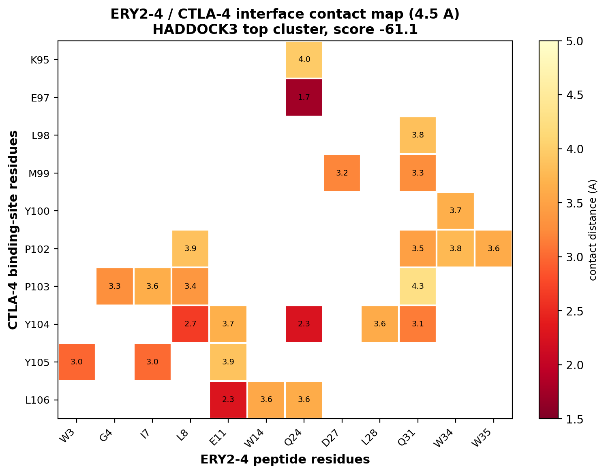

# Prediction of the ERY2-4 Peptide Binding Site on CTLA-4 by Restraint-Guided and Blind Molecular Docking

[]()
[]()
[]()
[]()

**Author:** M. R. Sakeer

Computational identification of the binding site of the affinity-matured helix–loop–helix (HLH) peptide **ERY2-4** on the immune-checkpoint receptor **CTLA-4**, combining **restraint-guided (information-driven) docking** and **blind (*ab initio*) docking**. The study provides a structural rationale for the experimentally-reported competitive inhibition of the CTLA-4 / B7-1 interaction by ERY2-4.

---

## Table of Contents
1. [Scientific background](#scientific-background)
2. [Aim](#aim)
3. [System](#system)
4. [Two docking strategies](#two-docking-strategies)
5. [Key findings](#key-findings)
6. [Methods](#methods)
7. [Results in detail](#results-in-detail)
8. [Validation and confidence](#validation-and-confidence)
9. [Repository structure](#repository-structure)
10. [Reproducibility](#reproducibility)
11. [Limitations](#limitations)
12. [Future directions](#future-directions)
13. [References](#references)
14. [Author and citation](#author-and-citation)

---

## Scientific background

CTLA-4 (Cytotoxic T-Lymphocyte-Associated protein 4, UniProt P16410) is an inhibitory immune-checkpoint receptor expressed on activated T-cells. It engages the B7 ligands B7-1 (CD80, UniProt P33681) and B7-2 (CD86) with higher avidity than the co-stimulatory receptor CD28, thereby attenuating T-cell activation. Antagonism of CTLA-4 is a clinically validated cancer-immunotherapy strategy.

**ERY2-4** is a disulfide-cyclised helix–loop–helix peptide obtained by yeast-surface-display affinity maturation (Ramanayake et al., *ACS Chem. Biol.* 2020, 15, 360–368). Experimentally it:

- binds human CTLA-4 with **K<sub>D</sub> ≈ 197 nM** (surface plasmon resonance),
- **competitively inhibits** the CTLA-4 / B7-1 interaction (**IC<sub>50</sub> ≈ 1.1 µM**),
- is selective for CTLA-4 over CD28.

The structural basis of this inhibition — specifically, **where ERY2-4 binds on CTLA-4** — was not determined experimentally. This repository addresses that question computationally.

---

## Aim

Predict the binding site of ERY2-4 on CTLA-4 and test whether it overlaps the native B7-1 ligand interface. Overlap would provide a direct structural mechanism (orthosteric competition) for the experimentally-observed inhibition.

---

## System

| Component | Identity | Source |
|-----------|----------|--------|
| Target receptor | CTLA-4 (chain C) | PDB **1I8L** |
| Natural ligand / reference | B7-1 / CD80 (chain A) | PDB **1I8L** |
| Ligand to dock | ERY2-4 peptide (39 aa) | AlphaFold2 model |
| ERY2-4 sequence | `CAWGQAILEGELAWLEGGGGGAGQLADLKRQLAWWKQAC` | Fig. 3b, Ramanayake et al. 2020 |

**Note on PDB 1I8L chains.** The asymmetric unit contains two copies of each protein: chains **C** and **D** are CTLA-4; chains **A** and **B** are B7-1/CD80. The crystal captures a CTLA-4 homodimer bridging two B7-1 molecules. A single copy of the receptor (chain C) is sufficient for docking; the native B7-1 interface was derived from the interacting chain pair A–C (44 residue contacts, 4.5 Å heavy-atom cutoff).

---

## Two docking strategies

This study deliberately uses **two independent docking strategies** and compares them. This is central to the rigour of the work.

### 1. Restraint-guided docking (information-driven)
Ambiguous Interaction Restraints (AIRs) were used to **direct** the peptide toward the B7-1 region of CTLA-4. The justification is experimental: because ERY2-4 is known to competitively inhibit B7-1, it is reasonable to test the hypothesis that it binds at or near the B7-1 site. Restraint-guided docking tests this hypothesis and, being informed by prior knowledge, is expected to be the more accurate of the two for a flexible peptide.

### 2. Blind docking (*ab initio*)
**No interaction restraints** were supplied. The peptide was allowed to sample the entire CTLA-4 surface using surface-wide random-AIR sampling of 1000 rigid-body models. Blind docking serves as an **unbiased control**: if the peptide localises to the B7-1 region *without* being guided there, this constitutes independent support and guards against the circularity inherent in restraint-guided docking alone.

> The combination is the point: **restraint-guided docking tests the hypothesis; blind docking checks that the answer was not merely imposed by the restraints.** Agreement between the two strengthens the conclusion.

---

## Key findings

1. **Restraint-guided docking** places ERY2-4 on the C-terminal segment of the B7-1 binding surface of CTLA-4, contacting residues **95, 97, 98, 99, 100, 102, 103, 104, 105, 106**, centred on the **Pro102–Pro103–Tyr104–Tyr105** ligand-recognition motif (part of CTLA-4's MYPPPYY ligand-binding loop).
   - HADDOCK score **−61.1 ± 2.0**; top cluster of 10 models; buried surface area **995 Ų**.
   - **90 % overlap (9/10 residues)** with the experimentally-defined B7-1 interface.

2. **The interface chemistry reproduces the experimental structure–activity data.** The peptide tryptophans (Trp3, Trp34, Trp35) and Leu8 dominate the contacts against CTLA-4 Tyr104/Tyr105 — consistent with the conserved Leu→Trp substitution identified as critical for binding by Ramanayake et al.

3. **Blind docking** independently localises ERY2-4 to the B7-1 surface region (residues 61–70, abutting B7-1 residues 63/65 at 0.0 Å), rather than to a distant/allosteric site. A spatial "tiebreaker" analysis confirms **both the restraint-guided and blind strategies converge on the B7-1 binding surface**.

4. Together these support a model in which **ERY2-4 competitively blocks CTLA-4/B7-1 engagement by occupying the B7-1 binding surface**, providing a structural rationale for the inhibition reported experimentally.

> **Confidence.** This is a well-supported, experimentally-consistent structural hypothesis derived from restraint-guided docking and corroborated by blind docking — not an experimentally-determined complex structure. The precise contact sub-region should be confirmed by mutagenesis.

---

## Methods

### Structure preparation
- **Receptor:** CTLA-4 chain C extracted from PDB 1I8L and cleaned (`prepare_ctla4_receptor.py`).
- **Native B7-1 interface:** computed directly from 1I8L at a 4.5 Å heavy-atom cutoff, auto-detecting the interacting chain pair (A–C, 44 residue contacts) (`extract_b7_interface.py`). B7-1 interface residues: 33, 35, 53, 63, 65, 95, 97, 99, 100, 101, 102, 103, 104, 105, 106.
- **Peptide:** ERY2-4 3D model generated from sequence with AlphaFold2 (ColabFold); top-ranked model retained.
- Chains standardised (receptor = A, peptide = B) for restraint consistency (`fix_chains.py`).
- **Restraints:** AIRs for the guided run built by `generate_haddock_restraints.py`.

### Docking (HADDOCK3 v2026.5.0, in Docker)
Both strategies use the same data-driven workflow:

```
topoaa → rigidbody → seletop → flexref → emref → clustfcc → seletopclusts → caprieval
```

- **Restraint-guided run** (`run_haddock3_docker.py`): 200 rigid-body models, AIRs targeting the B7-1 region.
- **Blind run** (`run_abinitio.py`): 1000 rigid-body models, no AIRs, surface-wide random-AIR sampling.

HADDOCK3 was executed inside a Docker container (the official open-source release; the same engine as the HADDOCK web server, requiring no separate registration).

### Analysis
- Interface contacts (Biopython, 4.5 Å) for each run (`analyze_binding_site.py`, `analyze_abinitio.py`).
- Comparison against the native B7-1 interface.
- Spatial "tiebreaker" quantifying each candidate site's proximity to the B7-1 surface (`tiebreaker.py`).
- Interface contact-map figure (matplotlib; `make_figure.py`).

---

## Results in detail

### Restraint-guided docking — top cluster

| Metric | Value | Interpretation |
|--------|-------|----------------|
| HADDOCK score | −61.1 ± 2.0 | Strongly favourable |
| Cluster size | 10 models | Well-converged |
| Buried surface area | 995 Ų | Large interface |
| Van der Waals | −37.5 | Good shape complementarity |
| Electrostatics | −33.8 | Favourable polar contacts |
| Desolvation | −26.0 | Favourable |

**Closest interfacial contacts**

| CTLA-4 | ERY2-4 | Distance (Å) |
|--------|--------|--------------|
| Glu97 | Gln24 | 1.74 |
| Tyr104 | Gln24 | 2.25 |
| Leu106 | Glu11 | 2.29 |
| Tyr104 | Leu8 | 2.66 |
| Tyr105 | Trp3 | 2.98 |
| Tyr105 | Ile7 | 3.01 |



### Overlap with the B7-1 interface

| | Residues |
|--|----------|
| B7-1 interface | 33, 35, 53, 63, 65, 95, 97, 99, 100, 101, 102, 103, 104, 105, 106 |
| ERY2-4 (guided) | 95, 97, 98, 99, 100, 102, 103, 104, 105, 106 |
| **Shared (90 %)** | 95, 97, 99, 100, 102, 103, 104, 105, 106 |

### Blind docking and spatial tiebreaker

| Site | Origin | B7-1 overlap | Closest approach | Verdict |
|------|--------|--------------|------------------|---------|
| 95–106 | Restraint-guided | 9 residues | 0.0 Å | Direct steric overlap |
| 61–70 | Blind (*ab initio*) | 2 residues | 0.0 Å | Abuts B7-1 surface |

Both candidate sites contact the B7-1 interface; neither is distant/allosteric. The restraint-guided and blind strategies therefore **converge on the B7-1 binding surface**.

---

## Validation and confidence

The result is supported by four independent lines of evidence:
1. **Favourable, converged energetics** (score −61, 995 Ų BSA, 10-model cluster).
2. **Chemical consistency with experimental SAR** (peptide tryptophans engaging the CTLA-4 tyrosine pocket).
3. **Convergence of restraint-guided and blind docking** onto the B7-1 surface.
4. **Consistency with the measured phenotype** (competitive inhibition explained by orthosteric occupancy).

A built-in negative control: when input structures were incorrect (an unfolded peptide model / mismatched chain identifiers), docking energies collapsed to ≈0 with no convergence; favourable, converged energetics emerged only once inputs were corrected — indicating the reported interface is a genuine energetic minimum rather than an artefact.

---

## Repository structure

```
CTLA4-ERY24-Binding-Site-Analysis/
│
├── README.md                          Project overview (this file)
├── Dockerfile                         HADDOCK3 container definition (Ubuntu + HADDOCK3)
├── docker-compose.yml                 Optional container orchestration
├── requirements.txt                   Python dependencies (Biopython, numpy, pandas, matplotlib)
├── .gitignore                         Excludes large regenerable HADDOCK outputs
│
├── scripts/                           == All analysis and docking scripts ==
│   │
│   │   -- Structure & input preparation --
│   ├── analyze_ery24_sequence.py      Compute ERY2-4 physicochemical properties & composition
│   ├── extract_b7_interface.py        Derive native B7-1 interface on CTLA-4 from 1I8L
│   │                                    (auto-detects interacting chain pair A-C, 4.5 A cutoff)
│   ├── prepare_ctla4_receptor.py      Extract & clean CTLA-4 chain C from 1I8L
│   ├── build_ery24_structure.py       (Legacy) initial backbone builder; superseded by AlphaFold
│   ├── fix_chains.py                  Standardise chain IDs (receptor = A, peptide = B)
│   ├── generate_haddock_restraints.py Build ambiguous interaction restraints (AIRs) for guided run
│   │
│   │   -- Docking (two strategies) --
│   ├── run_haddock3_docker.py         RESTRAINT-GUIDED docking (AIRs -> B7-1 region, 200 models)
│   ├── run_abinitio.py                BLIND / ab-initio docking (no restraints, 1000 models)
│   ├── run_ensemble.py                Replicate-run driver (reproducibility checks)
│   │
│   │   -- Analysis & visualisation --
│   ├── analyze_binding_site.py        Extract ERY2-4 contact residues (guided run)
│   ├── analyze_abinitio.py            Extract ERY2-4 contact residues (blind run)
│   ├── compare_ensemble.py            Compare binding sites across replicate runs
│   ├── tiebreaker.py                  Spatial proximity of each site to the B7-1 surface
│   └── make_figure.py                 Generate the interface contact-map figure (matplotlib)
│
├── config/                            == HADDOCK restraints & workflow configs ==
│   ├── ery24_restraints.tbl           AIR restraints (guided run): peptide <-> B7-1 region
│   ├── restraints_summary.json        Human-readable summary of restraint definitions
│   ├── haddock3_workflow.cfg          Guided-run workflow definition
│   ├── haddock3_abinitio.cfg          Blind-run workflow definition
│   └── haddock3_run_*.cfg             Per-run configuration snapshots
│
├── structures/                        == Input 3D structures (PDB) ==
│   ├── ctla4_receptor.pdb             CTLA-4 chain C (raw extract from 1I8L)
│   ├── ctla4_A.pdb                    CTLA-4 receptor, chain relabelled A (docking input)
│   ├── ery24_alphafold.pdb            ERY2-4 model from AlphaFold2 (raw, chain A)
│   └── ery24_B.pdb                    ERY2-4 peptide, chain relabelled B (docking input)
│
├── report/                            == Deliverables ==
│   ├── ERY24_CTLA4_BindingSite_Report.pdf   Full written report
│   ├── ERY24_contact_map.png                Interface contact-map figure (Figure 1)
│   ├── ery24_binding_site_final.txt         Guided-run binding site + detailed contacts
│   └── abinitio_binding_site.txt            Blind-run binding site
│
└── results/                           == Key result files (large run dirs git-ignored) ==
    ├── ERY24_contact_map.png
    ├── ery24_binding_site_final.txt
    ├── abinitio_binding_site.txt
    └── ensemble_consensus.txt

Notes:
  - The large HADDOCK output directories (results/haddock3_run_*, results/haddock3_abinitio;
    hundreds of MB of intermediate models) are excluded via .gitignore and are fully
    regenerable by running the scripts.
  - The ERY2-4 AlphaFold model is provided in structures/ (generated externally via ColabFold).
```

---

## Reproducibility

**Prerequisites:** Docker Desktop; Python 3.10+ with Biopython, NumPy, pandas, matplotlib.

```bash
# 1. Build the HADDOCK3 docking container
docker build -t haddock3-ery24:latest .

# 2. Prepare inputs
python scripts/analyze_ery24_sequence.py     # peptide properties
python scripts/extract_b7_interface.py        # native B7-1 interface from 1I8L
python scripts/prepare_ctla4_receptor.py      # CTLA-4 receptor
python scripts/fix_chains.py                  # standardise chain IDs (A/B)
python scripts/generate_haddock_restraints.py # build AIR restraints (guided run)

# 3a. Restraint-guided docking (~15-30 min)
python scripts/run_haddock3_docker.py

# 3b. Blind (ab-initio) docking (~1-2 h)
python scripts/run_abinitio.py

# 4. Analysis & figure
python scripts/analyze_binding_site.py        # guided-run binding site
python scripts/analyze_abinitio.py            # blind-run binding site
python scripts/tiebreaker.py                  # proximity of each site to B7-1
python scripts/make_figure.py                 # contact-map figure
```

The ERY2-4 3D model is provided in `structures/` (generated externally with AlphaFold2/ColabFold from the sequence in Fig. 3b of the reference paper).

---

## Limitations

- **Restraint dependence.** The 95–106 mode is obtained by **restraint-guided** docking targeting the B7-1 region and is not the global minimum of unguided scoring; the **blind** run localises nearby (61–70) but not identically. The defensible claim is that ERY2-4 binds *at the B7-1 interface*, with the exact footprint unresolved.
- **No experimental reference complex.** CAPRI-type metrics reflect internal consistency, not accuracy against a ground-truth structure (none exists for the ERY2-4/CTLA-4 complex).
- **Single peptide conformer** was docked; peptide flexibility was sampled only during semi-flexible refinement.
- **Deterministic runs.** Repeated executions of the restraint-guided workflow reproduce the same dominant solution (stable/reproducible, but not independent stochastic sampling).

---

## Future directions

1. **Experimental discrimination (priority):** alanine mutagenesis (e.g. CTLA-4 Y104A/Y105A, ERY2-4 W34A) to resolve the exact footprint and test the predicted contacts.
2. **Co-docking exclusivity test:** verify computationally that ERY2-4 and B7-1 cannot occupy CTLA-4 simultaneously, directly testing the competitive model.
3. **Ensemble docking:** dock multiple AlphaFold conformers of ERY2-4 to assess conformer-dependence of the predicted site.

---

## References

1. Ramanayake, S. et al. *Affinity Maturation of Helix–Loop–Helix Peptides that Target CTLA-4.* ACS Chem. Biol. 2020, 15, 360–368.
2. Honorato, R. V. et al. *HADDOCK3 / The HADDOCK2.4 web server for integrative modeling of biomolecular complexes.* BonvinLab. https://github.com/haddocking/haddock3
3. Mirdita, M. et al. *ColabFold: making protein folding accessible to all.* Nat. Methods 2022, 19, 679–682.
4. Stamper, C. C. et al. *Crystal structure of the B7-1/CTLA-4 complex.* PDB 1I8L.

---

> M. R. Sakeer. *Prediction of the ERY2-4 Peptide Binding Site on CTLA-4 by Restraint-Guided and Blind Molecular Docking.* GitHub repository, 2026.

---

*This repository presents a computational structural prediction for research purposes. It is not an experimentally-determined structure.*
